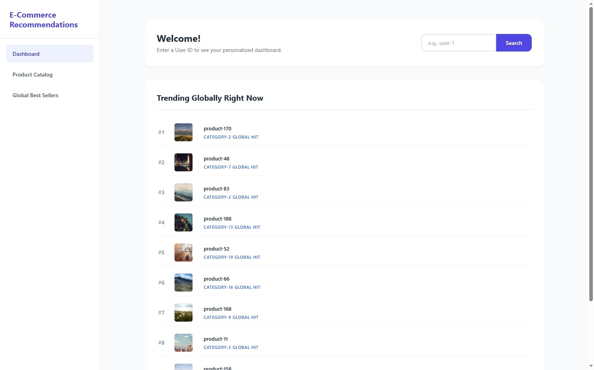
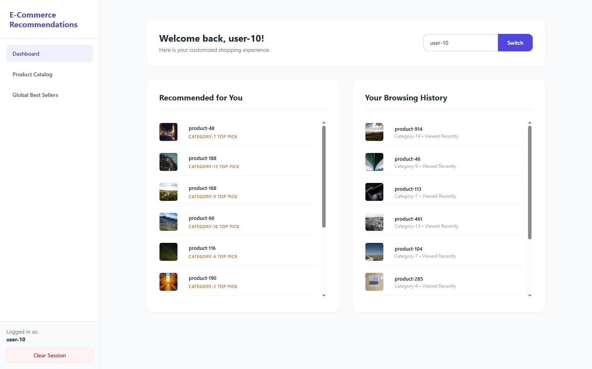
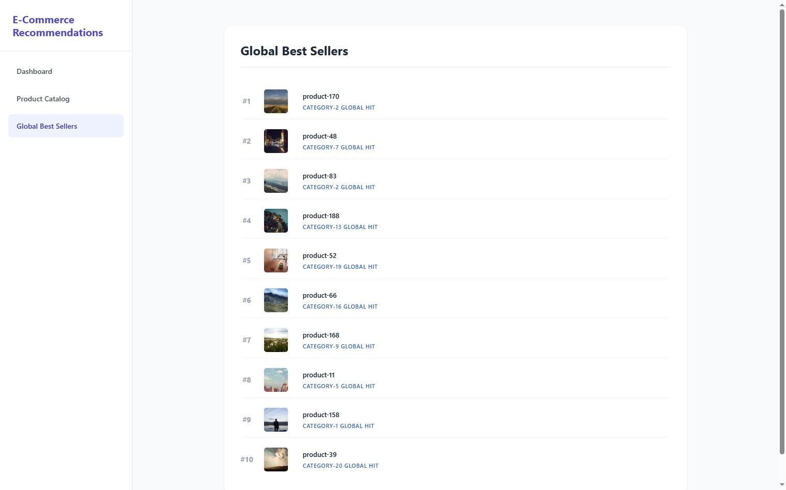
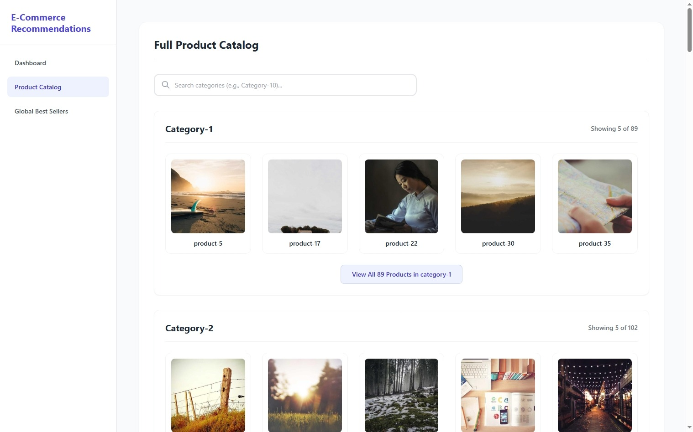
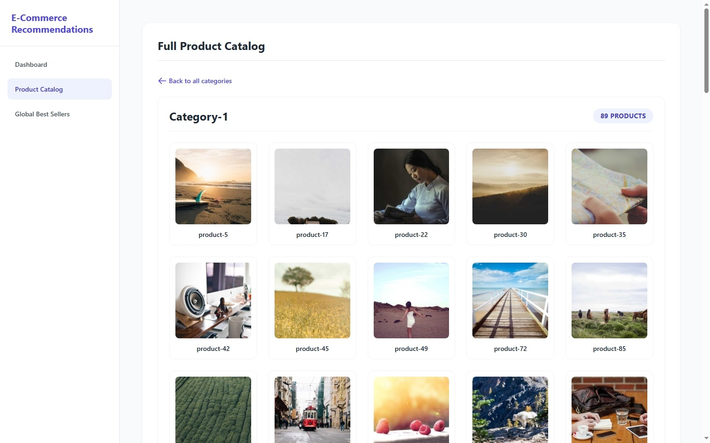

# Real-Time E-Commerce Recommendation Engine

Event-driven microservices architecture designed to process real-time user browsing behavior and generate personalized and global product recommendations.


## Architecture & Tech Stack

* **Frontend:** React, Vite, Zustand (State Management), Tailwind CSS
* **Backend:** Python 3.14, FastAPI, SQLAlchemy 2.0 (Async), Pydantic
* **Message Broker:** Apache Kafka (Kraft Mode)
* **Database & Caching:** PostgreSQL (Asyncpg), Redis
* **Data Processing:** 
    * **Kafka Producer:** Simulates real-times events, reading from product-views.json
   * **Kafka Consumer:** Reads real-time streams from Kafka topics and writes to the database. 
    * **ETL Worker:** Periodically refreshes data. 
* **Infrastructure:** Docker & Docker Compose
***
### Project Structure
```text
.
├── backend/
│   ├── api/            # FastAPI application, Pydantic models, Async DB routers
│   ├── etl/            # Periodic background worker for calculating best-sellers
│   └── kafka_services/ # Kafka Producer (Simulator) and Batch Consumer
├── frontend/           # React + Vite SPA, Zustand Store, Tailwind UI
├── .env                # Environment variables
└── docker-compose.yml  # Container orchestration
```
***
##  Getting Started

### Prerequisites
* [Docker](https://www.docker.com/) and Docker Compose installed on your machine.
* Git installed.

### 1. Clone the Repository
```bash
git clone [https://github.com/gulzeynep/e-commerce_app](https://github.com/gulzeynep/e-commerce_app)
cd e-commerce_app
```

### 2. Environment Variables
Copy the .env.example file and rename it to .env and change according to your settings:
```bash
cp .env.example .env
```

### 3. Build and Run 
Start all services using Docker Compose:
```bash
docker-compose up --build 
#add -d tag (before --build) for running in background
```
Docker will pull the necessary images, build the Python and Node.js environments, and start the services in the correct dependency order.

### 4. Access Points
Once the containers are up and healthy, you can access the applications via your browser:
* **Frontend Dashboard:** http://localhost:5173
* **FastAPI Swagger UI (Docs):** http://localhost:8000/docs
* **PostgreSQL Database:** localhost:5433
***
### Useful Docker Commands
* Stop and erase the application: docker-compose down
* Stop and wipe all data (Reset Database & Kafka): docker-compose down -v
* Check logs of a specific service: docker logs <container_name> (e.g., docker logs backend)
*** 

### Testing 
```bash
pytest -v --cov=api --cov=etl --cov-report=term-missing --cov-report=html
```
***

### API Endpoints 
```bash
| Method | Endpoint | Description |
|--------|----------|-------------|
| `GET`  | `/catalog` | Fetches the full product catalog (Served directly from Redis) |
| `GET`  | `/best-sellers/general` | Returns the global top 10 products calculated by the ETL worker |
| `GET`  | `/best-sellers/personalized/{user_id}` | Returns top products from categories the user recently viewed |
| `GET`  | `/browsing-history/{user_id}` | Retrieves the 10 most recent active products viewed by the user |
| `DELETE`| `/browsing-history/{user_id}/{product_id}` | Soft-deletes a specific product from a user's history |
```

### Frontend Look





